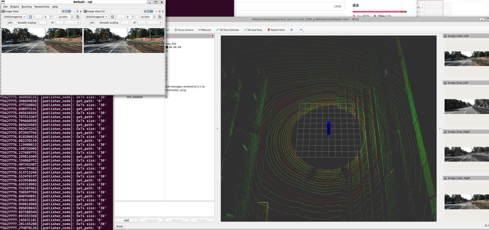

AI-ROBOT

姓名：DIAOXIN

传感器ros2 实验

3D环境可视化：显示激光雷达点云、相机图像、地图和机器人模型等。
机器人状态监控：实时监控机器人位置、姿态和关节状态。
调试工具：帮助开发者识别和解决系统中的问题。
插件架构：允许用户根据需要加载和卸载插件。
多功能性：支持图形化显示话题数据、参数服务器管理、图像视图等。
易用性：用户界面简洁直观，适合不同层次的开发者使用。

